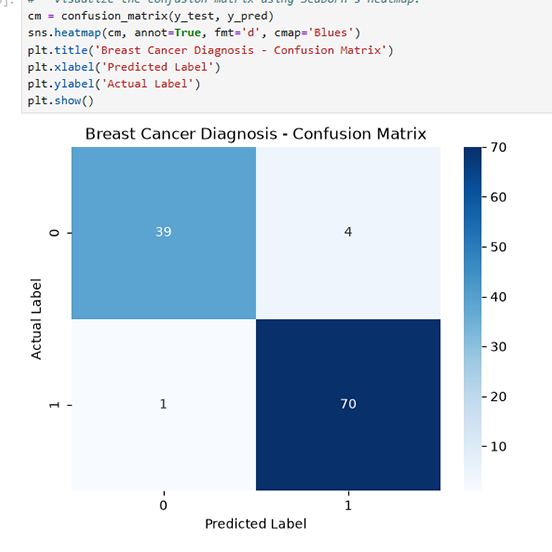
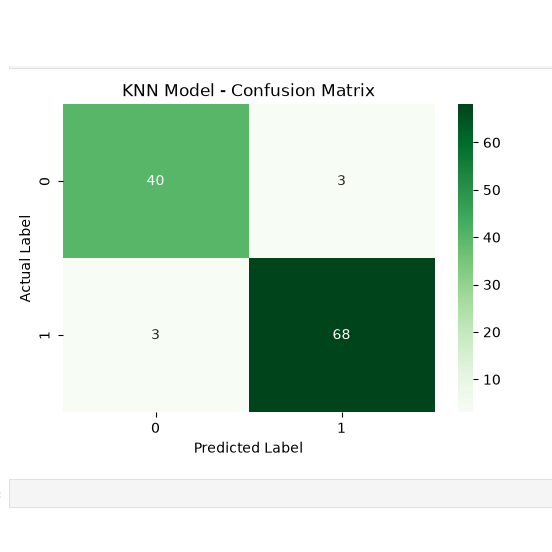

# Breast Cancer Diagnosis Classifier 🩺🔬

## 📌 Project Overview
This machine learning project focuses on building and comparing binary classification models to predict whether a breast cancer tumor is **Malignant (0)** or **Benign (1)**. The project compares two popular algorithms: **Logistic Regression** and **K-Nearest Neighbors (KNN)**, evaluating their true performance using K-Fold Cross-Validation.

## 🛠️ Technologies Used
* **Python 3**
* **Pandas & NumPy:** Data manipulation and numerical operations
* **Scikit-Learn:** Machine learning models, data scaling, and cross-validation
* **Matplotlib & Seaborn:** Data visualization (Confusion Matrix heatmaps)

## 📊 Dataset
The dataset used is the built-in **Breast Cancer Wisconsin (Diagnostic) Dataset** provided by `sklearn.datasets.load_breast_cancer()`. It contains numerical features computed from digitized images of fine needle aspirates (FNA) of breast masses.

## 🚀 Workflow & Key Steps
1. **Data Loading:** Extracted features and target variables directly from Scikit-Learn.
2. **Feature Scaling (`StandardScaler`):** Standardized the features to have a mean of 0 and a variance of 1. This was a critical step, especially for the KNN algorithm, which relies on distance measurements between data points.
3. **Model Training:** Trained a Logistic Regression model (`max_iter=5000`) and a KNN model (`K=5`).
4. **Evaluation:** Evaluated both models using a standard 80/20 train-test split (Baseline).
5. **Cross-Validation:** Implemented 5-Fold Cross-Validation to validate the realistic and robust performance of both models on unseen data.
6. **Visualizations:** Created Confusion Matrix heatmaps to deeply analyze False Positives and False Negatives, which is crucial in healthcare data.

## 🏆 Model Comparison & Results

| Algorithm | Baseline Accuracy (80/20 Split) | Average CV Accuracy (5-Fold) |
| :--- | :--- | :--- |
| **Logistic Regression** | 95.61% | 95.08% |
| **K-Nearest Neighbors (KNN)** | 94.74% | **96.49%** |

### 💡 Key Takeaways:
* **The Winner:** **KNN** outperformed Logistic Regression after Cross-Validation, achieving a highly reliable **96.49%** accuracy. Since similar types of tumors group closely together based on their features, a distance-based algorithm like KNN performed exceptionally well.
* **The Power of Cross-Validation:** 
  * For Logistic Regression, the Baseline (95.61%) was higher than the CV (95.08%), showing the model got a slightly "lucky" train-test split.
  * For KNN, the Baseline (94.74%) was much lower than the CV (96.49%), showing an "unlucky" split. 
  * **Conclusion:** Cross-Validation successfully revealed the true, realistic performance of both models, proving that we should never rely on a single train-test split.

## 📉 Confusion Matrices
Understanding model errors is critical in medical diagnosis. Below are the confusion matrices for both models:

### Logistic Regression vs. K-Nearest Neighbors (KNN)
<p align="center">
  
  
</p>
*(Note: 0 = Malignant, 1 = Benign)*

## 💻 How to Run This Project
1. Clone this repository:
   ```bash
   git clone [https://github.com/RashmikaKDH/breast-cancer-logistic-regression.git](https://github.com/RashmikaKDH/breast-cancer-logistic-regression.git)
